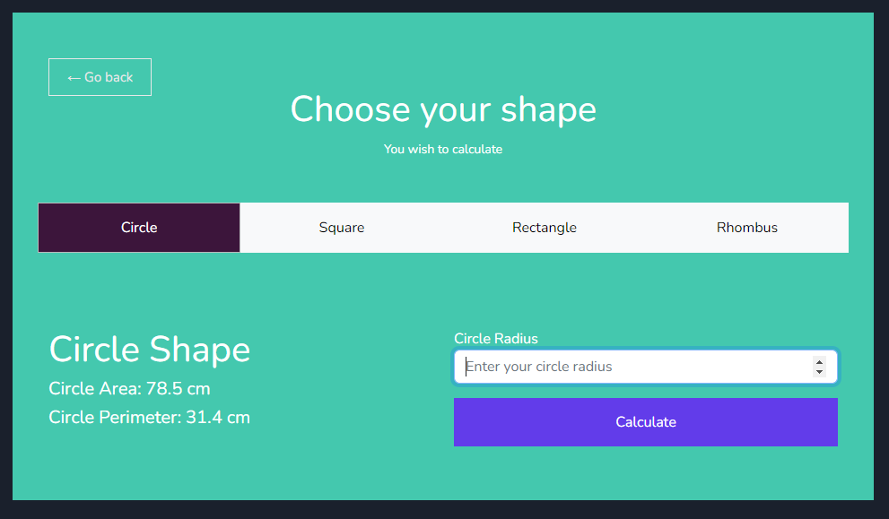

### Geometry Exercise
This is Geometry Task Exercise. This will calculate various shapes area and perimeter which is currently set to default values in their relevant classes. It uses Shape interface and shape classes with open closed principles.

### Install

1. Clone / Download repository - https://github.com/vrbin90s/KiloAcademy-Geometry-Exercise.git
2. In your terminal run composer install command:
   ``composer install``
3. Rename .env.example file to .env or copy example content to your empty .env file
4. Generate your new application encryption key using artisan command:
   ``php artisan key:generate``
5. Run project with artisan command:
6. ``php artisan run serve``

### Some Info

Just for example we use routes to output shape calculation results. In the main view window you will find links to the routes where results of the shapes will be outputted. This uses a single ShapeInterface that will output shape calculations based on the logic in their individual classes.

### Additional implementations

1. Implemented PHPUnit Testing, 
2. Added User Interface (view files) to calculate shape area and perimeter by given input values. 
3. Polished open and closed principle files.
4. Refactored file architecture.

